# Analog Modulation Techniques - MATLAB Implementation 📡🎛️

A comprehensive MATLAB implementation of analog communication modulation techniques including DSB-LC (Double Sideband Large Carrier), DSB-SC (Double Sideband Suppressed Carrier), and SSB (Single Sideband) modulation with complete modulation/demodulation analysis.

[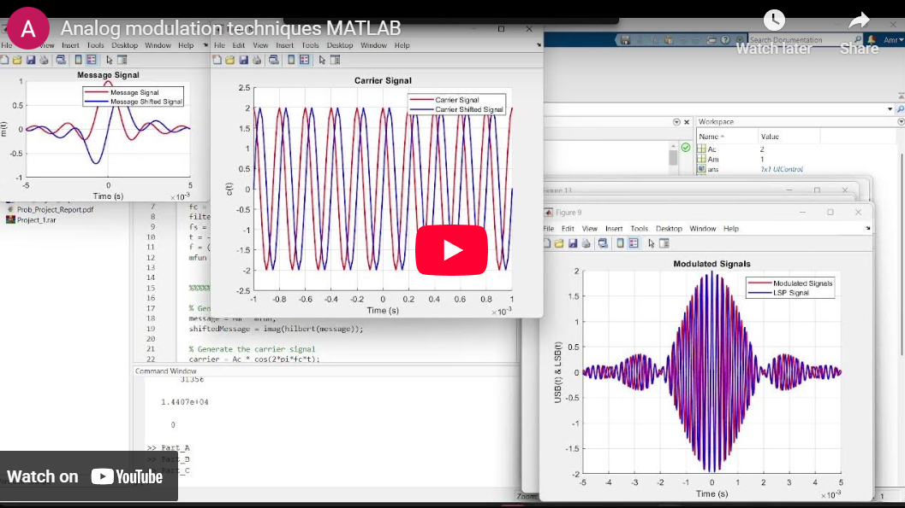](https://www.youtube.com/embed/sPZeHUMbXuI?si=zHKNyW3VusSjxczp)

## 📋 Description

This project demonstrates the fundamental concepts of analog communication systems through MATLAB simulations. It covers three major modulation techniques used in amplitude modulation systems, providing comprehensive analysis of signal characteristics, frequency spectrum, and demodulation processes.

The implementation includes interactive visualization, spectral analysis, and demodulation with adjustable filter parameters to understand the effects of different modulation indices and carrier frequency offsets.

<br>
<div align="center">
  <a href="https://codeload.github.com/TendoPain18/analog-modulation-techniques-matlab/legacy.zip/main">
    
  </a>
</div>

## 🎯 Project Objectives

1. **Implement DSB-LC Modulation**: Large carrier amplitude modulation with different modulation indices
2. **Implement DSB-SC Modulation**: Suppressed carrier modulation and coherent demodulation
3. **Implement SSB Modulation**: Upper and lower sideband generation using Hilbert transform
4. **Analyze Frequency Spectrum**: FFT analysis and spectral visualization
5. **Study Demodulation Effects**: Investigate carrier frequency offset impacts

## ✨ Features

### Part A: DSB-LC (Double Sideband Large Carrier)
- **Multiple Modulation Indices**: Ka = 0.5, 1.0, 2.0
- **Two Message Signals**: Triangular and step-function waveforms
- **Amplitude Modulation**: Standard AM with carrier component
- **Visualization**: Time-domain plots of message and modulated signals

### Part B: DSB-SC (Double Sideband Suppressed Carrier)
- **Carrier Suppression**: No carrier component in modulated signal
- **Coherent Demodulation**: Product detector implementation
- **Low-Pass Filtering**: Second-order Butterworth filter for signal recovery
- **Before/After Filtering**: Comparison of filtered and unfiltered demodulation

### Part C: SSB (Single Sideband)
- **Hilbert Transform**: Phase shifting for SSB generation
- **USB and LSB**: Upper and lower sideband modulation
- **Spectral Analysis**: Real and imaginary spectrum components
- **Frequency Offset Analysis**: Effects of carrier frequency mismatch
- **Interactive Filter Control**: Adjustable cutoff frequency with slider

## 🔬 Theoretical Background

### DSB-LC Modulation

**Modulation Equation:**
```
s(t) = Ac[1 + Ka·m(t)]cos(2πfct)
```

Where:
- `Ac` = Carrier amplitude
- `Ka` = Amplitude sensitivity
- `m(t)` = Message signal
- `fc` = Carrier frequency

**Modulation Index:**
```
μ = Ka × max|m(t)|
```

### DSB-SC Modulation

**Modulation Equation:**
```
s(t) = m(t) × Ac·cos(2πfct)
```

**Demodulation:**
```
y(t) = s(t) × cos(2πfct) = (1/2)m(t) + (1/2)m(t)cos(4πfct)
```

After low-pass filtering: `m_recovered(t) = (1/2)m(t)`

### SSB Modulation

**Upper Sideband (USB):**
```
s_USB(t) = m(t)cos(2πfct) - m̂(t)sin(2πfct)
```

**Lower Sideband (LSB):**
```
s_LSB(t) = m(t)cos(2πfct) + m̂(t)sin(2πfct)
```

Where `m̂(t)` is the Hilbert transform of `m(t)`

## 📊 Results & Analysis

### Part A: DSB-LC Results

**Modulation Index Analysis:**

| Ka | Modulation Index | Observation |
|----|------------------|-------------|
| 0.5 | 0.5 | Under-modulation, no distortion |
| 1.0 | 1.0 | 100% modulation, critical point |
| 2.0 | 2.0 | Over-modulation, envelope distortion |

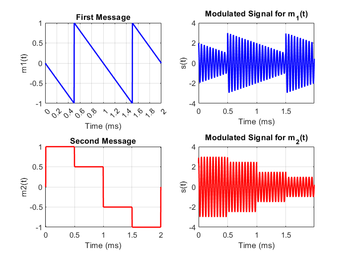

*Under-modulation with Ka = 0.5*

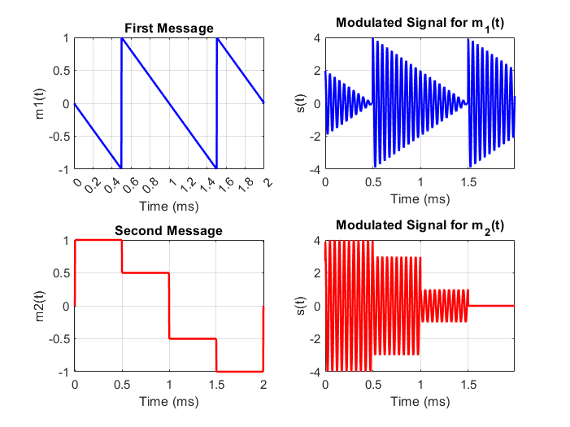

*Critical modulation with Ka = 1.0*

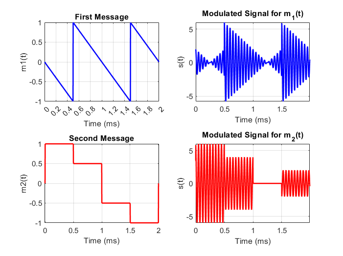

*Over-modulation with Ka = 2.0 showing distortion*

### Part B: DSB-SC Results

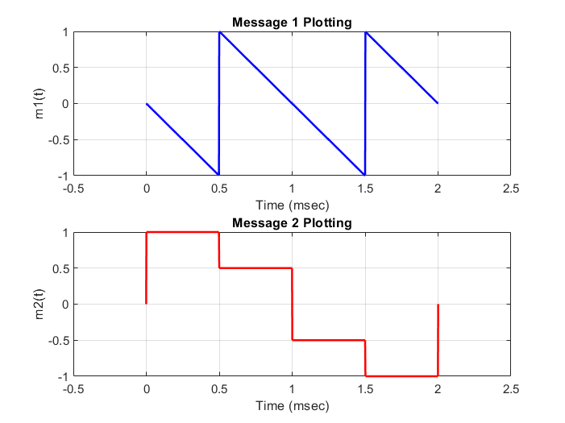

*Original message signals m1(t) and m2(t)*

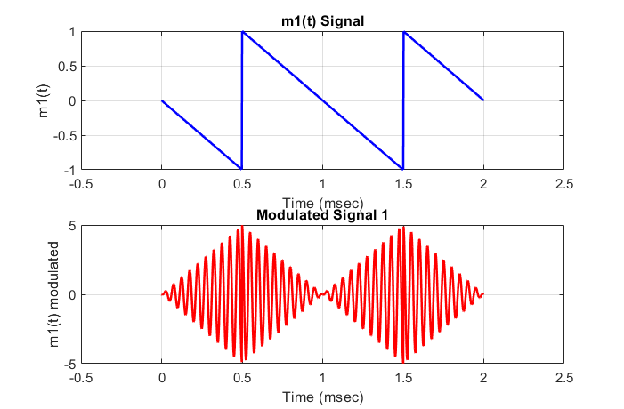

*DSB-SC modulated signal for m1(t)*

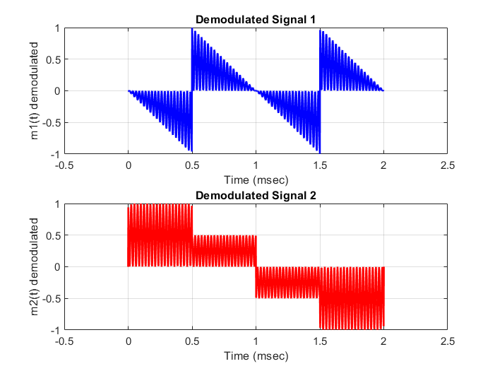

*Demodulated signals before filtering*

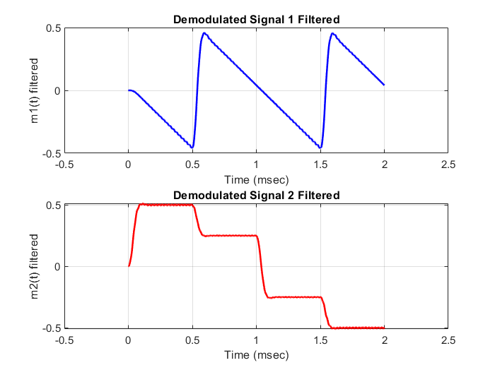

*Recovered signals after low-pass filtering*

**Key Observations:**
- Modulated signal amplitude proportional to message amplitude
- Demodulated signal has half amplitude of original: `(1/2)m(t)`
- Low-pass filter successfully removes high-frequency components
- Small distortion due to filter characteristics

### Part C: SSB Results

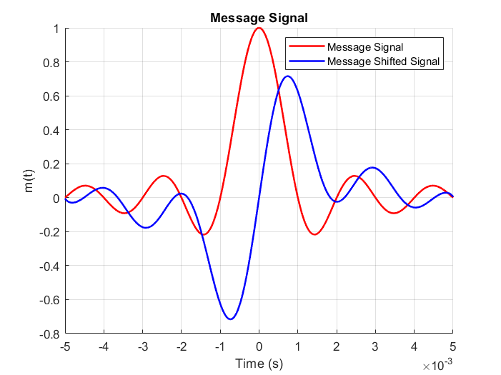

*Message signal and its Hilbert transform (90° phase shift)*


*Carrier signal and its Hilbert transform*

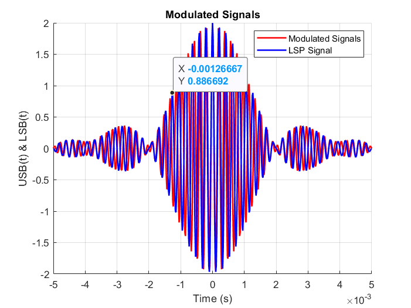

*USB and LSB signals on same plot*

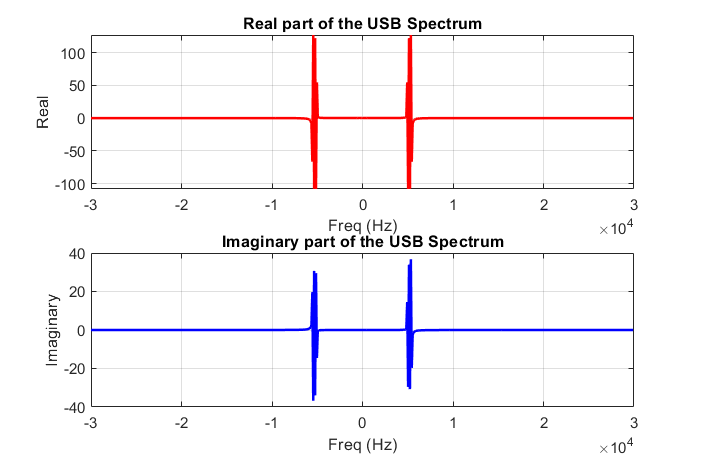

*Frequency spectrum of USB signal*

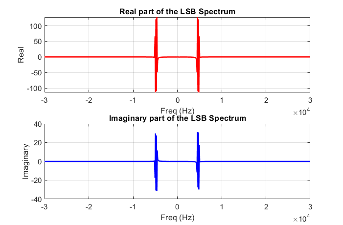

*Frequency spectrum of LSB signal*

**Spectral Analysis:**
- USB contains frequencies above carrier (fc to fc + B)
- LSB contains frequencies below carrier (fc - B to fc)
- USB and LSB are mirror images in frequency domain
- Single sideband reduces bandwidth by 50%

### Carrier Frequency Offset Effects

**Case 1: f1 = fc + 0.1B**

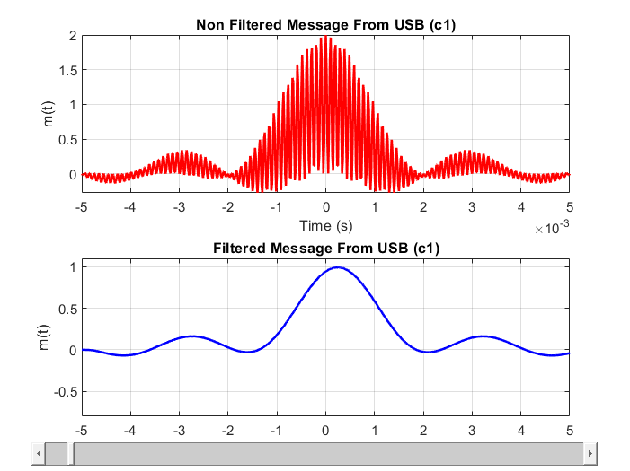

*USB demodulation with +0.1B frequency offset*

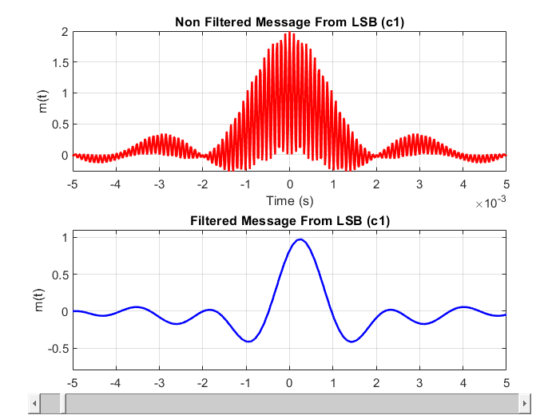

*LSB demodulation with +0.1B frequency offset*

**Observation:** Positive frequency offset causes:
- USB: Lower frequency shift in recovered signal
- LSB: Higher frequency shift in recovered signal

**Case 2: f2 = fc - 0.2B**


*USB demodulation with -0.2B frequency offset*

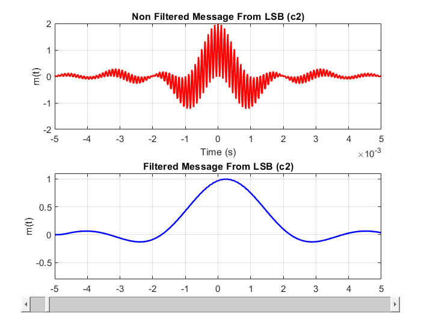

*LSB demodulation with -0.2B frequency offset*

**Observation:** Negative frequency offset causes:
- USB: Higher frequency shift in recovered signal
- LSB: Lower frequency shift in recovered signal

## 🚀 Getting Started

### Prerequisites

**MATLAB Requirements:**
```
MATLAB R2018a or later
Signal Processing Toolbox
Control System Toolbox
```

### Installation

1. **Clone the repository**
```bash
git clone https://github.com/yourusername/analog-modulation-techniques-matlab.git
cd analog-modulation-techniques-matlab
```

2. **Open MATLAB**
```matlab
cd 'path/to/analog-modulation-techniques-matlab'
```

3. **Run the scripts**
```matlab
% For DSB-LC modulation
Part_A

% For DSB-SC modulation
Part_B

% For SSB modulation
Part_C
```

## 📖 Usage Guide

### Part A: DSB-LC Modulation
```matlab
% Modify parameters in Part_A.m
fc = 10000;      % Carrier frequency (Hz)
Ac = 2;          % Carrier amplitude (V)
Ka = 0.5;        % Modulation index (0.5, 1, or 2)

% Run the script
Part_A
```

**Outputs:**
- Time-domain plots of m1(t) and m2(t)
- Modulated signals s1(t) and s2(t)
- Modulation index calculation

### Part B: DSB-SC Modulation
```matlab
% Modify parameters in Part_B.m
fc = 10e3;       % Carrier frequency (Hz)
Ac = 5;          % Carrier amplitude (V)
Wc = 60;         % Filter cutoff frequency

% Run the script
Part_B
```

**Outputs:**
- Message signals
- DSB-SC modulated signals
- Demodulated signals (before filtering)
- Recovered signals (after filtering)

### Part C: SSB Modulation
```matlab
% Modify parameters in Part_C.m
Am = 1;          % Message amplitude
B = 1000;        % Message bandwidth (Hz)
Ac = 2;          % Carrier amplitude (V)
fc = 5000;       % Carrier frequency (Hz)

% Run the script
Part_C
```

**Outputs:**
- Hilbert-transformed signals
- USB and LSB signals
- Frequency spectrums
- Demodulated signals with adjustable filter
- Carrier offset analysis

### Interactive Filter Control

The SSB implementation includes an interactive slider to adjust the low-pass filter cutoff frequency in real-time:

- Slider range: 0 to 50×fc
- Default value: 2×fc
- Observe signal recovery with different filter bandwidths

## 🎓 Learning Outcomes

This project demonstrates:

1. **Amplitude Modulation**: DSB-LC, DSB-SC, and SSB techniques
2. **Modulation Index**: Effects of under/over-modulation
3. **Frequency Spectrum**: Fourier analysis and spectral properties
4. **Hilbert Transform**: Phase shifting for SSB generation
5. **Coherent Demodulation**: Product detector implementation
6. **Low-Pass Filtering**: Signal recovery and noise reduction
7. **Carrier Synchronization**: Impact of frequency offset
8. **MATLAB Programming**: Signal processing and visualization

## 📈 Key Concepts

### Modulation Index Effects

- **μ < 1**: Under-modulation, inefficient power usage
- **μ = 1**: 100% modulation, optimal condition
- **μ > 1**: Over-modulation, envelope distortion

### Bandwidth Comparison

| Modulation Type | Bandwidth |
|-----------------|-----------|
| DSB-LC | 2B |
| DSB-SC | 2B |
| SSB | B |

Where B is the message bandwidth

### Power Efficiency

**DSB-LC Power Distribution:**
```
Total Power = Carrier Power + Sideband Power
Carrier Power = Pc = (Ac²)/2
Sideband Power = Psb = (Ka² × Ac² × Pm)/2
```

**DSB-SC:** All power in sidebands (more efficient)

**SSB:** 50% of DSB-SC power, same information

## 🔧 Technical Implementation

### Low-Pass Filter Design

**Transfer Function:**
```matlab
H1 = Wc / (s + Wc)                        % First-order
H2 = Wc² / (s² + s×Wc×√2 + Wc²)          % Second-order
H_total = H1 × H2                         % Cascaded
```

### Hilbert Transform Implementation
```matlab
% Phase shift message and carrier by 90°
shiftedMessage = imag(hilbert(message));
shiftedCarrier = imag(hilbert(carrier));
```

### FFT Spectrum Analysis
```matlab
% Compute FFT
spectrum = fft(signal);

% Two-sided spectrum
spectrum_shifted = fftshift(spectrum);

% Real and imaginary components
real_part = real(spectrum_shifted);
imag_part = imag(spectrum_shifted);
```

## 🤝 Contributing

Contributions are welcome! Feel free to:

- Add new modulation techniques (FM, PM)
- Implement noise analysis
- Improve filter designs
- Enhance visualization
- Add more test signals

## 📄 License

This project is licensed under the MIT License - see the [LICENSE](LICENSE) file for details.

## 🙏 Acknowledgments

- Course: CIE 337 - Communications Theory and Systems
- Department: Communications and Information Engineering
- Communication systems fundamentals
- MATLAB Signal Processing Toolbox

<br>
<div align="center">
  <a href="https://codeload.github.com/TendoPain18/analog-modulation-techniques-matlab/legacy.zip/main">
    
  </a>
</div>

## <!-- CONTACT -->
<div id="toc" align="center">
  <ul style="list-style: none">
    <summary>
      <h2 align="center">
        🚀 CONTACT ME 🚀
      </h2>
    </summary>
  </ul>
</div>

<table align="center" style="width: 100%; max-width: 600px;">
  <tr>
    <td style="width: 20%; text-align: center;">
      <a href="https://www.linkedin.com/in/amr-ashraf-86457134a/" target="_blank">
        
      </a>
    </td>
    <td style="width: 20%; text-align: center;">
      <a href="https://github.com/TendoPain18" target="_blank">
        
      </a>
    </td>
    <td style="width: 20%; text-align: center;">
      <a href="mailto:amrgadalla01@gmail.com">
        
      </a>
    </td>
    <td style="width: 20%; text-align: center;">
      <a href="https://www.facebook.com/amr.ashraf.7311/" target="_blank">
        
      </a>
    </td>
    <td style="width: 20%; text-align: center;">
      <a href="https://wa.me/201019702121" target="_blank">
        
      </a>
    </td>
  </tr>
</table>

<!-- END CONTACT -->

## **Master the art of analog communication modulation! 📡✨**
